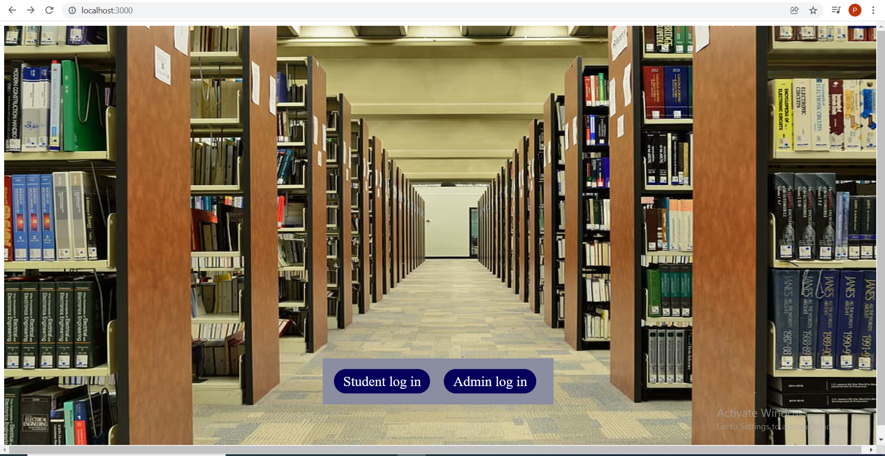
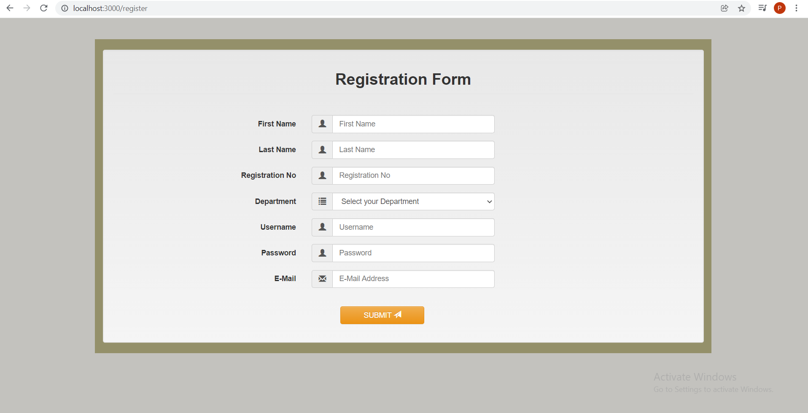
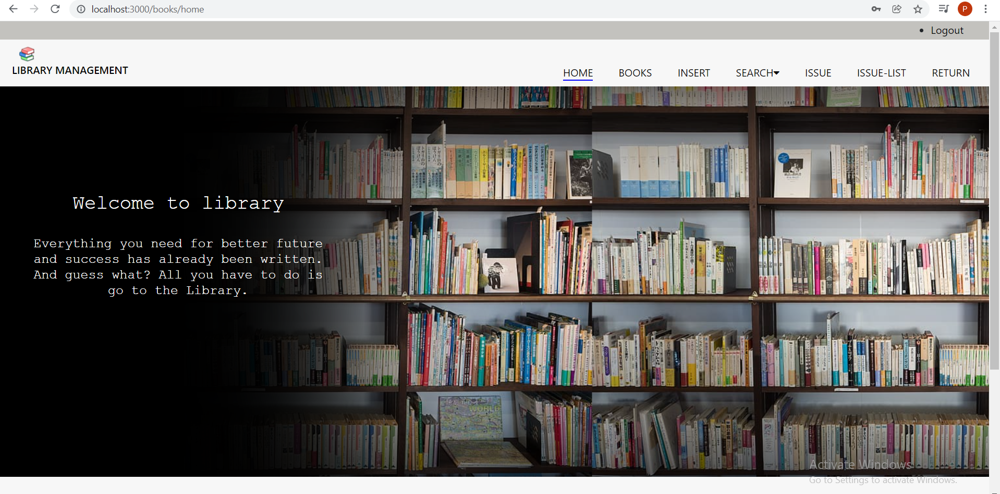
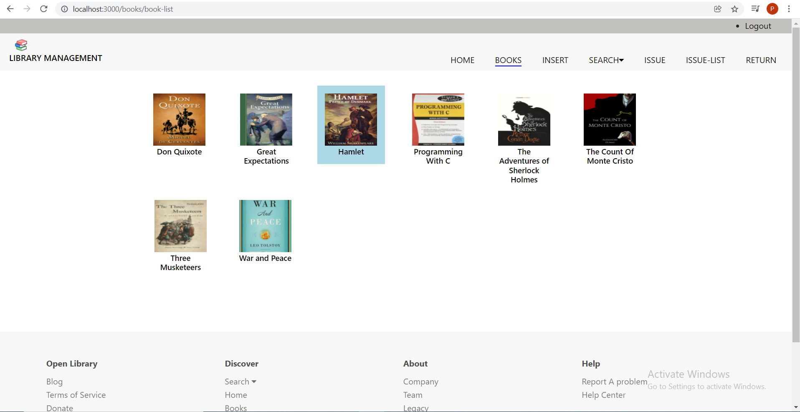
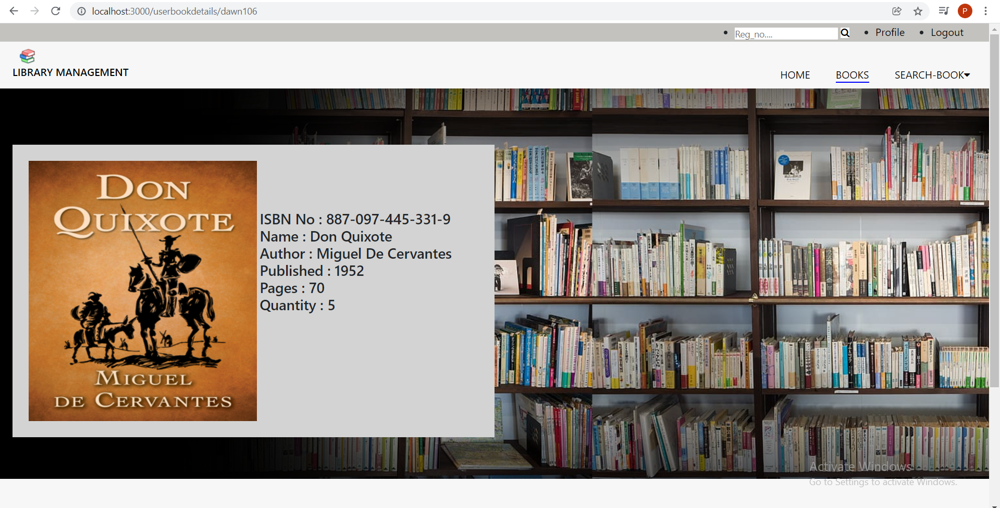
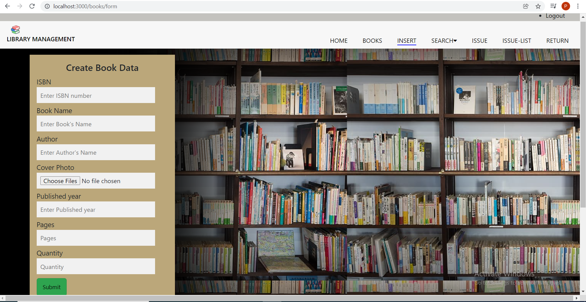
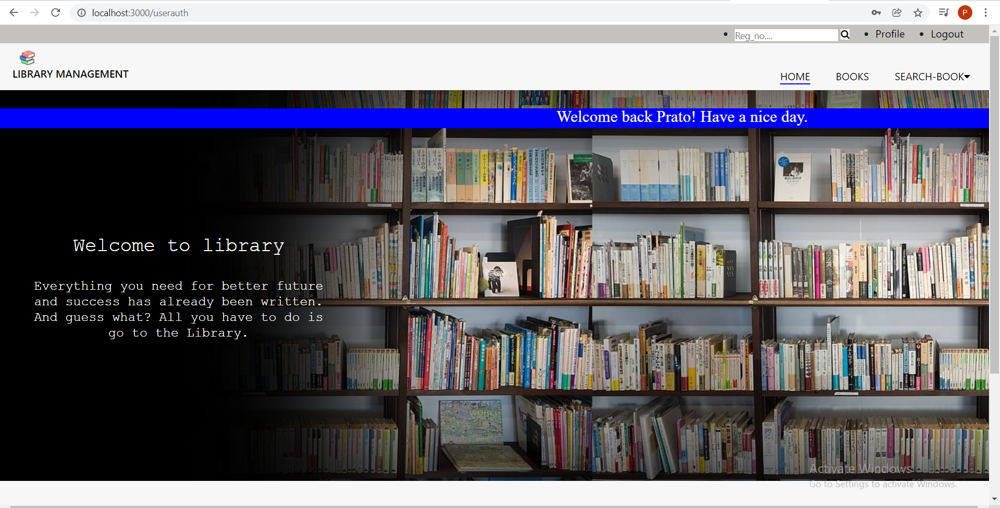
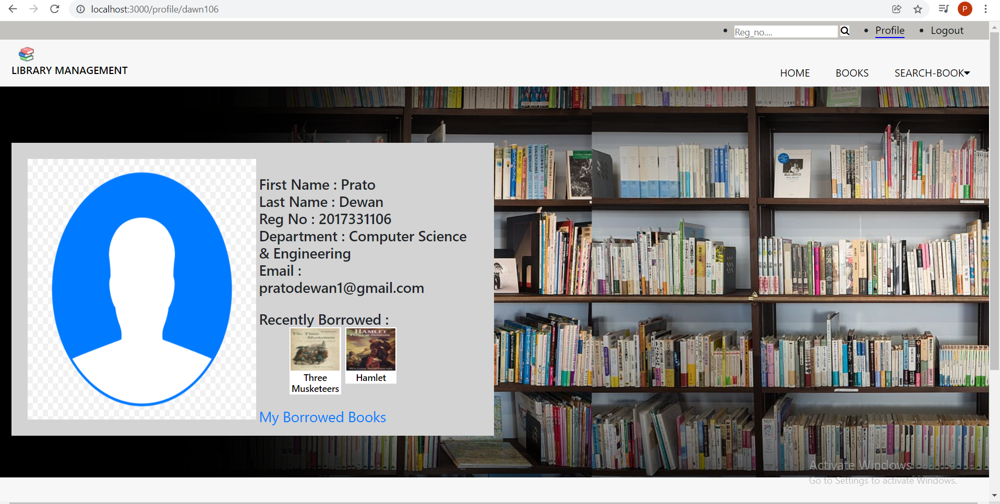

# Simple Library Management System

A library management system is the most proficient and easy to use system for managing all the processes involved in a Library in the most effective ways. This system will reduce all the manual work and the whole process can be managed just through single clicks and edits. Furthermore, I was interested to learn the basics of Web Development Technologies. For these reasons, I chose this project.

## Features

### Users
- Register and Login
- View and Search Books
- Search Users

### Admin
- Add,Edit and Remove Books
- View and Search Books
- Issue and Return Books

## Screenshots

